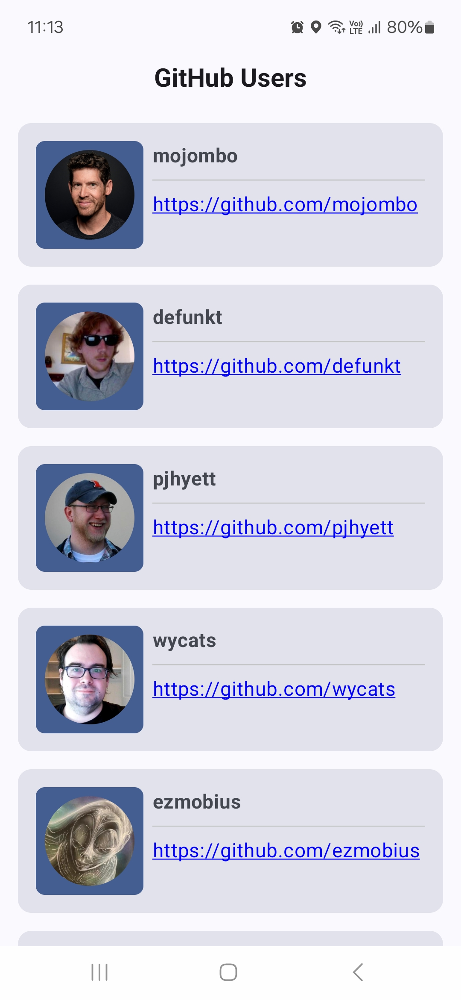

TymeXGitHubUsers
================

An Android Kotlin application shows user list and detail from GitHub.

Features
--------
- Show user list with pagination of 20 items per fetch
- Cache users data to show faster next time
- Support offline
- Navigate to user detail with animation on user item clicked

Demonstration
-------------

Youtube: [https://youtu.be/6ofrhrk0RB8](https://youtu.be/6ofrhrk0RB8)

Screenshots:

Note
----

Application may exceed the GitHub API limit quota without Authorization.
You can add your GitHub personal access token into local.properties file with:
gitHubPat = "TOKEN"

Technical
---------

- Clean architecture, MVVM
- Asynchronous: Coroutines
- UI: Jetpack Compose, Compose Animation
- DI: Koin
- Image Loading: Coil
- Logging: Kermit
- Network: Ktor, Kotlin Serialization
- Storage: Room
- Unit test: Junit, Mockk, Turbine